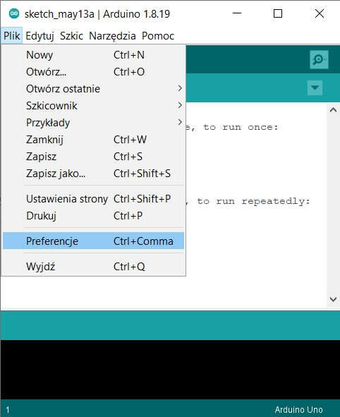
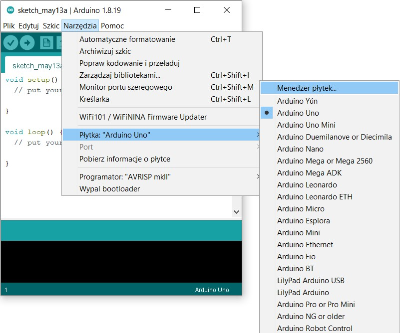
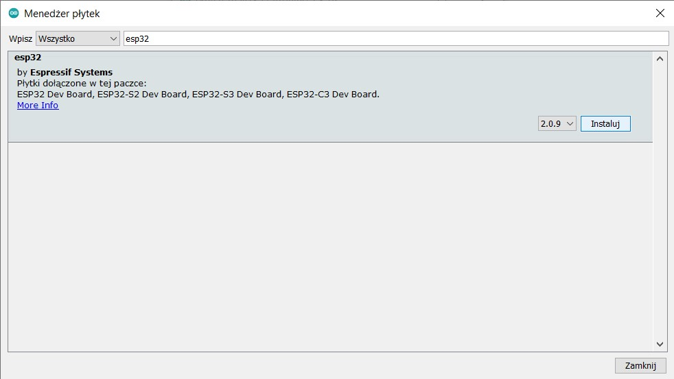
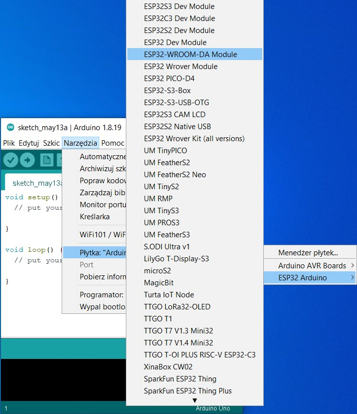
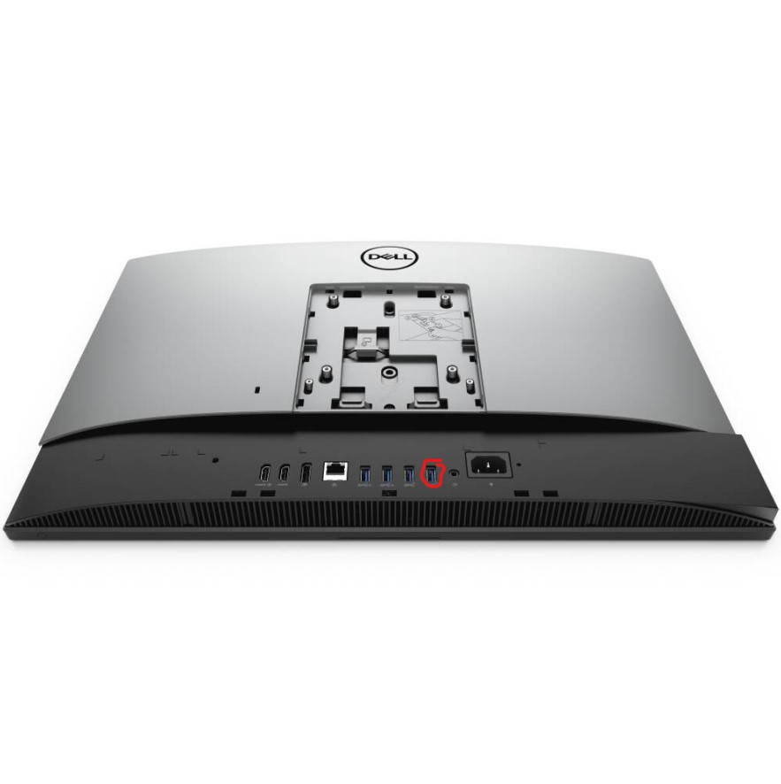
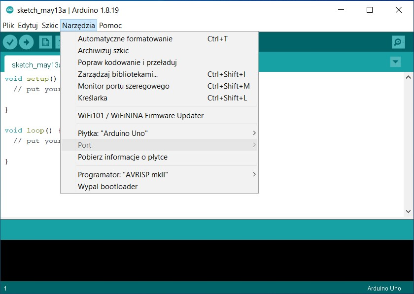
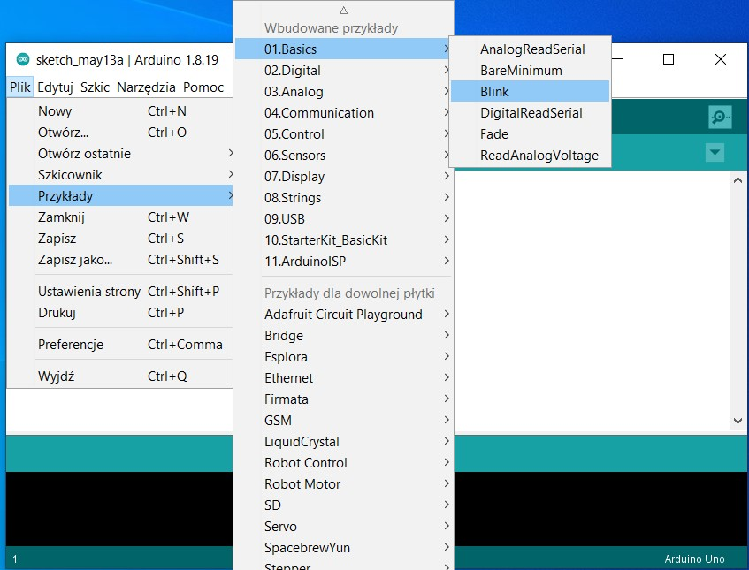

# Poradnik podłączenia mikrokotrolera ESP32devkit

Standardowo miktokontroler zasilany jest z przewodu USB, aby połaczyć go z komputerem i wymieniać dane musimy skonfigurować środowisko Arduino IDE
.

## Konfiguracja Arduino IDE
Początkowa konfiguracja wymaga wskazania paczki ze sterownikami płytki ESP32

1. Otwórz Arduino IDE i przejdz Plik > Preferencje (File> Preferences)


2. Wklej poniższy link w pole "Dodatkowe adresy URL dla menadzerów płytek"
```
https://raw.githubusercontent.com/espressif/arduino-esp32/gh-pages/package_esp32_index.json
```

i naciśnij przycisk OK

3.  Przejdz do Narzędzia> Płytka "Arduino UNO">Menadzer płytek 



4.  Wpisz w pole inputu esp32 i kliknij Instaluj



5. Środowisko zostało poprawnie skonfigurowane

## Podłączanie ESP32

1. Wchodzimy w Narzędzia> Płytka > ESP32 Arduino > ESP32 WROOMDAMODULE


2. Teraz możemy podłączyć płytke do tylnego portu USB komputera, a końcówke microUSB do portu mikrokontrolera. Niestety w pocznym porcie USB nam nie zadziała. 


3. Wybieramy Narzedzia> Port> COM4 (tylny lewy port)


4. Żeby zweryfikować połączenie ładujemy przykładowy skrypt Blink który Plik> Przykłady> 01.Basic> Blink

5. Dopisujemy inicjalizacje zmiennej 
```
int LED_BUILTIN = 2; 
```
